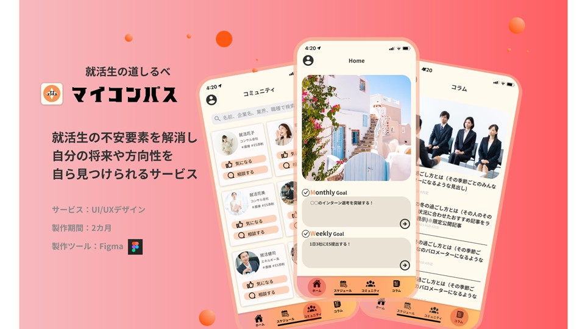
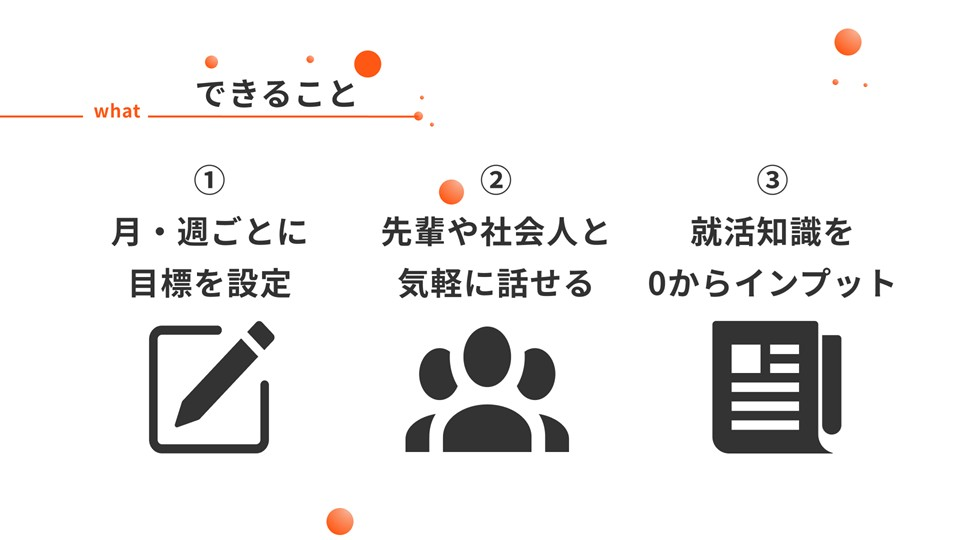

# UI/UX Webアプリ設計プロジェクト「マイコンパス」

## 概要
大学時代に取り組んだUI/UX設計プロジェクト。ユーザー課題をもとにWebアプリを企画し、FigmaでUI設計・プロトタイピングを行いました。

## 使用ツール
- Figma（UI設計・プロトタイプ）
- PowerPoint（プレゼン資料）

## プロセス
1. ユーザーインタビュー
2. ペルソナ設計
3. カスタマージャーニーマップ作成
4. ワイヤーフレーム設計
5. プロトタイプ作成

## 成果物
- [PDF資料をダウンロード](./マイコンパス_玉串涼夏.pdf)
- スクリーンショット（抜粋）

### スクリーンショット例

